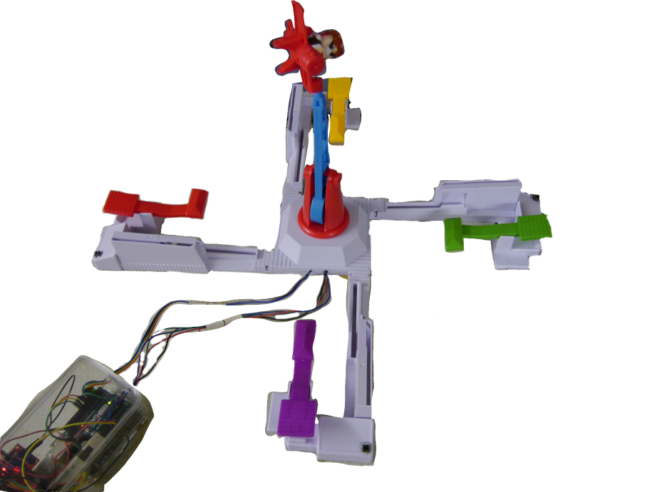
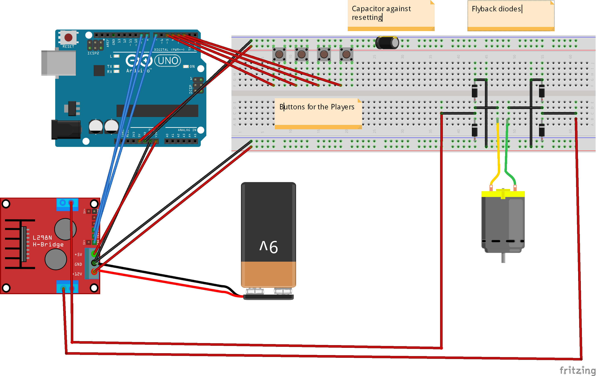

# Looping_Louie_EV
Software for controlling Looping Louie with push-buttons and a custom motor control

This is a repository for hardware installation information, as well as code for the arduino microcontroller, that enables you to
easily tweak an existing Looping Louie game into a upgraded version with custom modes and push buttons for each player.

# Hardware
The main hardware part was the L298N Dual H Bridge DC Stepper Motor Controller. You can find it with a quick search in the internet if you want to use the same.
But feel also free to use other hardware components and tell me how it went for you. If you use other components, you may need to overwrite the functions in the [hardware library file](library.h), to make it work with your setup.
## Wiring
The wiring is pretty straightforward, but I made an extra fritzing file to make it as easy as possible.
There are mainly 2 important things to mention:

Flyback diodes are used, to not let current from the motor that could happen on sudden change of direction come through to the arduino.

A capacitor in parrallel to the arduino power stopped resets on the arduino for me, that sometimes happened when Louie changed direction very fast.
I think this has to do with the 9V block battery not able to deliver enough current.

See also [Fritzing File](LoopingLouie.fzz)
# Software
The software is written to make it as easy as possible to add game modes on your own. Therefore, there are library like functions for the motor
control. You find them in [library.h](library.h).

## Adding your own game mode:
First, think of a name. You should prefix every variable and function with that name to avoid naming collisions. Now, edit the [Looping_Louie_EV.ino](Looping_Louie_EV.ino) file.

If you need a setup function, name it setup_new_mode() and call it below the other setup functions. This will be called every time  before the game is started.
Now, make a function new_mode(), and add it to the switch-case statement. When your game mode is selected, this function will be call as often as the arduino can.

If you want to wait a certain amount of time, you need to save the time, and then check if that amount is already reached. (Don't use delay in that function, as it will delay the whole execution).
See an example [here](game_modes/time_capped_boost.h)
